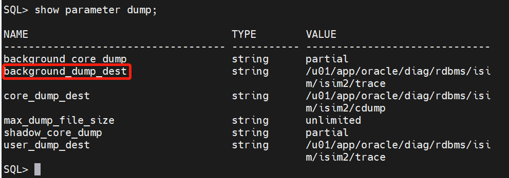

# 运维相关

## 通用

登陆数据库

```shell
sqlplus / as sysdba
```

查看启动模式

```sql
select open_mode from v$database;
```

名称查询

```sql
---查询数据库名
select name,dbid from v$database;
show parameter db_name;
---查询实例名
select instance_name from v$instance;
show parameter instance_name;
---查询数据库域名
select value from v$parameter where name='db_domain';
show parameter domain;
---查询数据库服务器
select value from v$parameter where name='service_name';
show parameter service;或者show parameter names;
---数据库服务名：此参数是数据库标识类参数，用service_name表示。数据库如果有域，则数据库服务名就是全局数据库名；如果没有，则数据库服务名就是数据库名。
show parameter service_name;
```


## 用户角色

查看用户

```sql
select * from dba_users;
select * from all_users;
select * from user_users;    //查看当前用户
```

创建用户

```sql
create user student          --用户名
  identified by "123456"     --密码
  default tablespace USERS   --表空间名
  temporary tablespace temp  --临时表空间名
  profile DEFAULT            --使用默认数据文件
  account unlock;            --解锁账户（lock:锁定、unlock解锁）
alter user STUDENT
  identified by "654321"    --修改密码
  account lock;             --修改锁定状态（LOCK|UNLOCK ）
```


查看系统角色

```sql
select * from dba_roles;
--查看所有角色的权限
select * from dba_role_privs;
--直接授予⽤户帐户的对象权限
select * from dba_tab_privs where grantee='用户名/角色';
--授予⽤户帐户的⾓⾊
select * from dba_role_privs where grantee='用户名/角色';
--授予⽤户帐户的系统权限
select * from dba_sys_privs where grantee='用户名/角色';
```

查看某个用户的权限

```sql
--用户权限包含直接授予的对象权限+系统权限+角色直接授予的对象权限+角色系统权限
--先查用户的角色
select * from dba_role_privs where grantee='用户名';
--查询角色的权限
select * from dba_tab_privs where grantee='用户名/角色';
select * from dba_sys_privs where grantee='用户名/角色';
```

授权

```sql
# 授权
--GRANT 对象权限 on 对象 TO 用户
--单表授权
grant select, insert, update, delete on 表名 to STUDENT;
--多表批量授权A授权给B
--先查出所有授权语句
select 'grant insert,select,update,delete on A.' || table_name || ' to B;' from all_tables where owner = 'A';
--执行上一步得到的结果
grant insert,select,update,delete on A.TABLE1 to B;
grant insert,select,update,delete on A.TABLE2 to B;
......
--GRANT 系统权限 to 用户
grant select any table to STUDENT;

# 取消
-- Revoke 对象权限 on 对象 from 用户
revoke select, insert, update, delete on JSQUSER from STUDENT;
 
-- Revoke 系统权限 from 用户
revoke SELECT ANY TABLE from STUDENT;
```

角色

```sql
CONNECT角色：基本角色。CONNECT角色代表着用户可以连接 Oracle 服务器，建立会话。
RESOURCE角色：开发过程中常用的角色。RESOURCE角色可以创建自己的对象，包括：表、视图、序列、过程、触发器、索引、包、类型等。
DBA角色：管理数据库管理员角色。拥有所有权限，包括给其他用户授权的权限。SYSTEM用户就具有DBA权限。

--创建角色
CREATE ROLE 角色名;
--授权角色
GRANT SELECT ON 表名 TO 角色名;
--将角色赋给用户
GRANT CONNECT to STUDENT;
GRANT RESOURCE to STUDENT;
--查询角色对应权限
--查询角色对象权限
select * from role_tab_privs where ROLE='READONLY_ROLE';
--查询角色系统权限
select * from role_sys_privs where ROLE='READONLY_ROLE';
--查询角色被授予的角色
select * from role_role_privs where ROLE='READONLY_ROLE';
--取消角色
-- Revoke 角色 from 用户
revoke RESOURCE from STUDENT;
```


## 表空间相关

表空间使用

```sql
select tablespace_name,sum(bytes)/1024/1024 from dba_data_files group by tablespace_name;
```

剩余表空间

```sql
select tablespace_name,sum(bytes)/1024/1024 from dba_free_space group by tablespace_name;
```

增加表空间

```sql
-- 查看数据文件存储方式
-- Oracle的表空间存储方式主要有三种：
-- 文件系统（通常非/dev目录开头，如/oradata
-- 裸设备(通常是/dev/r****方式)
-- ASM（非/开头，以+开头）
select file_id,file_name,tablespace_name from dba_data_files;
```

```sql
-- ASM ASM增加数据文件或者创建表空间不需要指定数据文件名，只要指定 diskgroup即可，ASM会自动命名。
alter tablespace 表空间名 add datafile '+DATADG' size 31G;
-- 文件系统
alter tablespace 表空间名 add datafile '/xx/xx.dbf' size 31G;
-- 裸设备
alter tablespace 表空间名 add datafile '/dev/rlv_name' size 31G;
```

## 查看日志

### 查看alert日志

1. 执行sql命令，查看trace文件位置：background_dump_dest就是后台日志

```sql
show parameter dump;
```



2. 退出sqlplus命令行，在linux命令行执行cd命令,切换到trace目录下

```shell
cd /u01/app/oracle/diag/rdbms/isim/isim2/trace
```

3. 带有alert关键字的文件，即是alert日志的名字

```shell
ls alert_*
```

